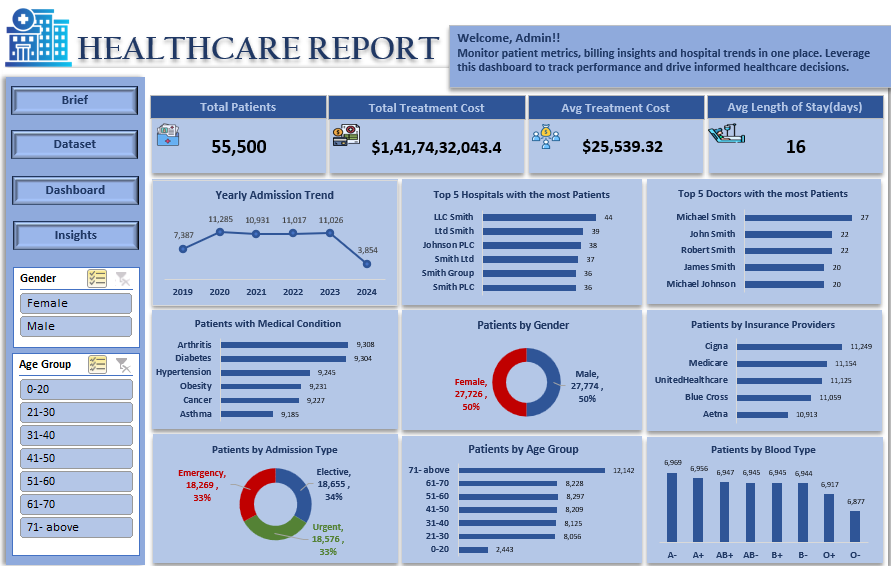

# 🏥 Healthcare Analytics & Patient Insights Dashboard using Excel

---

## 📌 Project Overview

This project presents an Excel-based interactive dashboard designed to analyze patient data across multiple hospitals. The aim is to transform raw healthcare data into meaningful insights for better decision-making and operational efficiency.

---

## 🎯 Business Objective

* Analyze patient trends across hospitals
* Understand treatment cost and stay duration
* Identify high-performing hospitals and doctors
* Evaluate insurance and admission patterns
* Support data-driven healthcare decisions

---

## 🛠️ Tools & Skills Used

* Microsoft Excel (Pivot Tables, Charts, Slicers)
* Data Cleaning & Transformation
* Data Analysis
* Dashboard Design

---

## 📊 Dashboard Features

* Year-wise patient trend analysis
* Medical condition distribution
* Gender and age group analysis
* Insurance provider breakdown
* Admission type analysis
* Hospital and doctor performance
* KPI Metrics (Total Patients, Avg Cost, Length of Stay)

---

## 📈 Key Insights

* Patient admissions vary across years with peak periods
* Gender distribution is balanced
* Certain diseases contribute majorly to total cases
* Insurance providers influence patient distribution
* Elder age group forms a significant portion
* Treatment patterns highlight areas for improvement

---

## 📊 Dashboard Preview

---

## 📁 Dataset

Dataset is not included due to size limitations.
You can use any similar healthcare dataset for practice.

---

## ⚙️ How to Use

1. Open the Excel file
2. Navigate to the Dashboard sheet
3. Use slicers to filter data
4. Analyze trends and insights

---

## 🧠 Conclusion

This project demonstrates how Excel can be used as a powerful tool for data analysis and dashboard creation. It helps in understanding healthcare trends and improving decision-making.

---

## 🚀 Future Enhancements

* Integration with Power BI
* Predictive analytics
* Advanced visualization

---

## 📌 Author

**Shruti Gorgile**
Aspiring Data Analyst

---
